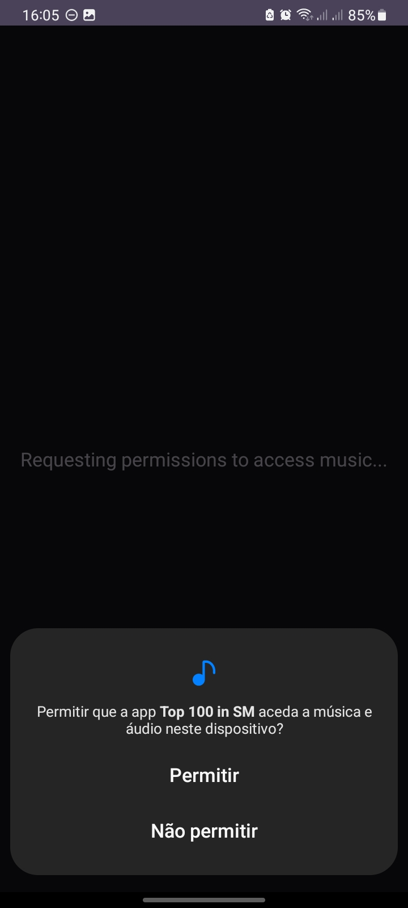
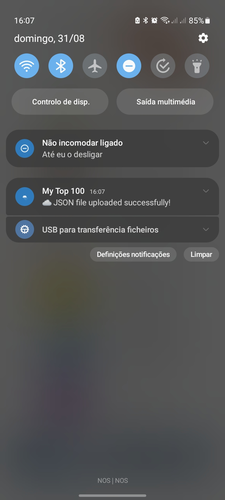

# My Top 100 in Samsung Music 🎵

Uma aplicação Android que analisa as tuas músicas mais ouvidas e faz upload para o Firebase.


## 📸 Screenshots

|   Permissões   | Ficheiro Encontrado | Upload Bem Sucedido |
|----------------|---------------------|---------------------|
|  |  |  |

## 🚀 Funcionalidades

- ✅ Encontra ficheiros M3U automaticamente
- ✅ Extrai metadados das músicas (título, artista, álbum)
- ✅ Gera URLs do YouTube automaticamente usando título + artista para pesquisa
- ✅ Autentica com Firebase
- ✅ Upload seguro para a cloud

## 📱 Como Funciona

1. A app pede permissões necessárias
2. Procura ficheiros `MOST_LISTENED.m3u` no dispositivo
3. Extrai informações das músicas
4. Converte tudo para JSON
5. Faz upload para Firebase Storage

## 🔧 Tecnologias Utilizadas

- **Android SDK** - Plataforma principal
- **Firebase** - Autenticação e Storage
- **Apache Tika** - Extração de metadados
- **Gson** - Conversão para JSON
- **WorkManager** - Tarefas em background

## 📋 Pré-requisitos

- Android 13+ (API 33)
- Java 17
- Ficheiro M3U no dispositivo
- Conexão à internet/dados móveis

## ⚙️ Instalação

1. Clonar o repositório:
```bash
git clone https://github.com/8126Lucas/top_from_samsung-music.git
```
2. Iniciar um projeto no Firebase
3. Obter as chaves SHA-1 e SHA-256 do Firebase:
```bash
# No Windows
keytool -list -v -keystore %USERPROFILE%\.android\debug.keystore -alias androiddebugkey -storepass android -keypass android
# Em Linux ou MacOS
keytool -list -v -keystore ~/.android/debug.keystore -alias androiddebugkey -storepass android -keypass android
```
4. Introduzir as chaves no projeto Firebase:
```bash
"Configurações do projeto" > "Seus aplicativos" > "Aplicativos Android" > "Adicionar impressão digital"
```
5. Fazer download do ficheiro `google-services.json`
6. Guardar o `google-services.json` em `top_from_samsung-music/android_java/app/`
7. Definir as regras do Firebase
```javascript
rules_version = '2';
service firebase.storage {
  match /b/{bucket}/o {
    match /{allPaths=**} {
      allow read: if true,
      allow write: if request.auth != null;
    }
  }
}
```

## ⚠️ Problemas Conhecidos

- A app só funciona com ficheiros M3U da Samsung Music
- Requer reinicialização se as permissões forem negadas
- Metadata extraction pode falhar com ficheiros corrompidos

## 🛠️ Resolução de Problemas

**Q: A app não encontra o ficheiro M3U?**  
A: Certifica-te que a playlist tem o nome **MOST_LISTENED**.

**Q: O upload falha?**  
A: Verifica a ligação à internet e as configurações do Firebase. Se o telemóvel estiver no modo poupança de bateria, a aplicação só funcionará se tiver permitido o uso de bateria sem restrição.
