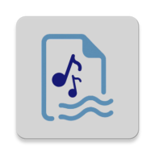
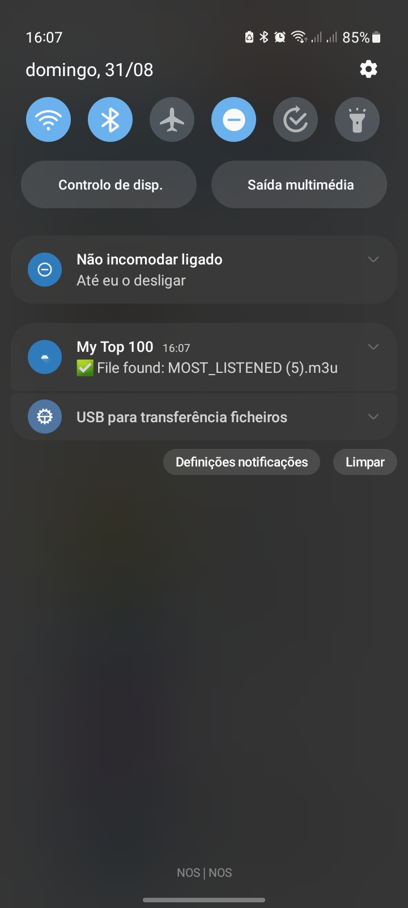
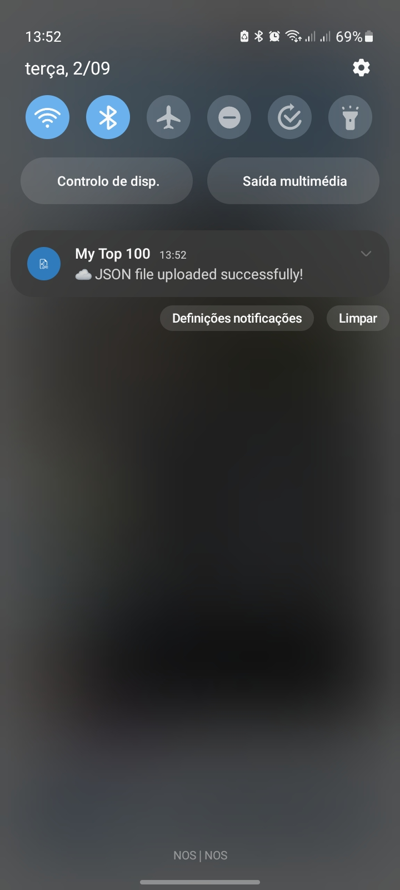
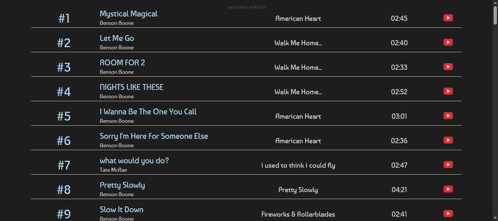

# My Top 100 in Samsung Music 🎵

<div align="center">
<a href="README.pt.md">Leia em Português</a> | <a href="#">Read in English</a>
</div>
<div align="center">

</div>


A **complete solution** that analyzes your most listened songs:
- 📱 Android app for data collection
- 🌐 Webpage for online visualization

## 📸 Screenshots

|   Permissions   | File Found | Successful Upload | Website |
|----------------|---------------------|---------------------|---------|
|  |  |  | 

## 🚀 Features

- ✅ Automatically finds M3U files
- ✅ Extracts song metadata (title, artist, album)
- ✅ Generates YouTube URLs automatically using title + artist for search
- ✅ Authenticates with Firebase
- ✅ Secure upload to the cloud

## 🌐 Visualization Webpage

In addition to the Android application, the project includes a webpage that displays the songs in a visual interface:

- ✅ Real-time visualization of data from Firebase
- ✅ Responsive design for all devices
- ✅ Smooth animations with GSAP
- ✅ Direct links to YouTube
- ✅ Date of last update

**Access:** [View my top listened songs](https://8126lucas.github.io/top_from_samsung-music/web/)

## 📱 How It Works

1. The app asks for necessary permissions
2. Searches for `MOST_LISTENED.m3u` files on the device
3. Extracts song information
4. Converts everything to JSON
5. Uploads to Firebase Storage

## 🔧 Technologies Used

### Android Application
- **Android SDK** - Main platform
- **Firebase** - Authentication and Storage
- **Apache Tika** - Metadata extraction
- **Gson** - Conversion to JSON
- **WorkManager** - Background tasks
### Web Frontend
- **HTML5/CSS3** - Responsive interface
- **JavaScript ES6** - Application logic
- **Firebase SDK** - Real-time connection
- **GSAP** - Animations and transitions

## 📋 Prerequisites

- Android 13+ (API 33)
- Java 17
- M3U file on the device
- Internet/mobile data connection

## ⚙️ Install the Application

1. Clone the repository:
```bash
git clone https://github.com/8126Lucas/top_from_samsung-music.git
```
2. Start a project in Firebase
3. Get the SHA-1 and SHA-256 keys from Firebase:
```bash
# On Windows
keytool -list -v -keystore %USERPROFILE%\.android\debug.keystore -alias androiddebugkey -storepass android -keypass android
# On Linux or macOS
keytool -list -v -keystore ~/.android/debug.keystore -alias androiddebugkey -storepass android -keypass android
```
4. Enter the keys in the Firebase project:
```bash
"Project settings" > "Your apps" > "Android apps" > "Add fingerprint"
```
5. Download the `google-services.json` file
6. Save the `google-services.json` in `top_from_samsung-music/android_java/app/`
7. Define the Firebase rules
```javascript
rules_version = '2';
service firebase.storage {
  match /b/{bucket}/o {
    match /{allPaths=**} {
      allow read: if true;
      allow write: if request.auth != null;
    }
  }
}
```
8. Compile and install on the device

## 🌐 Configure the Webpage

1. Upload the files `index.html`, `src/script.js`, `src/style.css` to a web server/GitHub Pages <br>
   - **Alternative:** Run `npm run dev` to test locally
2. Configure the Firebase rules (already defined above)
3. The webpage will automatically fetch the latest data

**Note:** To use with your own data, replace the Firebase configuration in `script.js` with your personal configuration.

## 📁 Project Structure
```bash
top_from_samsung-music/
├── android_java/
│   └── app/
│       ├── src/main/java/com/lucas8126/top100insm/
│       │   ├── PermissionsHandler.java   # Permission management
│       │   ├── MusicProcessor.java       # Main processing
│       │   ├── CollectTop.java           # Main service
│       │   └── ...
│       └── google-services.json          # Firebase configuration
└── web/
    ├── src
    │   ├── style.css
    │   ├── script.js
    │   └── ...
    └── index.html
```

## ⚠️ Known Issues

- The app only works with M3U files from Samsung Music
- Requires restart if permissions are denied
- Metadata extraction may fail with corrupted files

## 🛠️ Troubleshooting

**Q: The app does not find the M3U file?**  
**A:** Make sure the playlist is named **MOST_LISTENED**.

**Q: The upload fails?**  
**A:** Check the internet connection and Firebase settings. If the phone is in battery saver mode, the application will only work if you have allowed the use of battery without restriction.

## 👥 Authors
- [**Lucas Santos**](https://github.com/8126Lucas) - Android application and website development
- **Joana Alves** - Design and visual interface

## 🤝 How to Contribute

1. Fork the project
2. Create a branch for your feature (`git checkout -b feature/new-feature`)
3. Commit your changes (`git commit -am 'Add new feature'`)
4. Push to the branch (`git push origin feature/new-feature`)
5. Open a Pull Request
